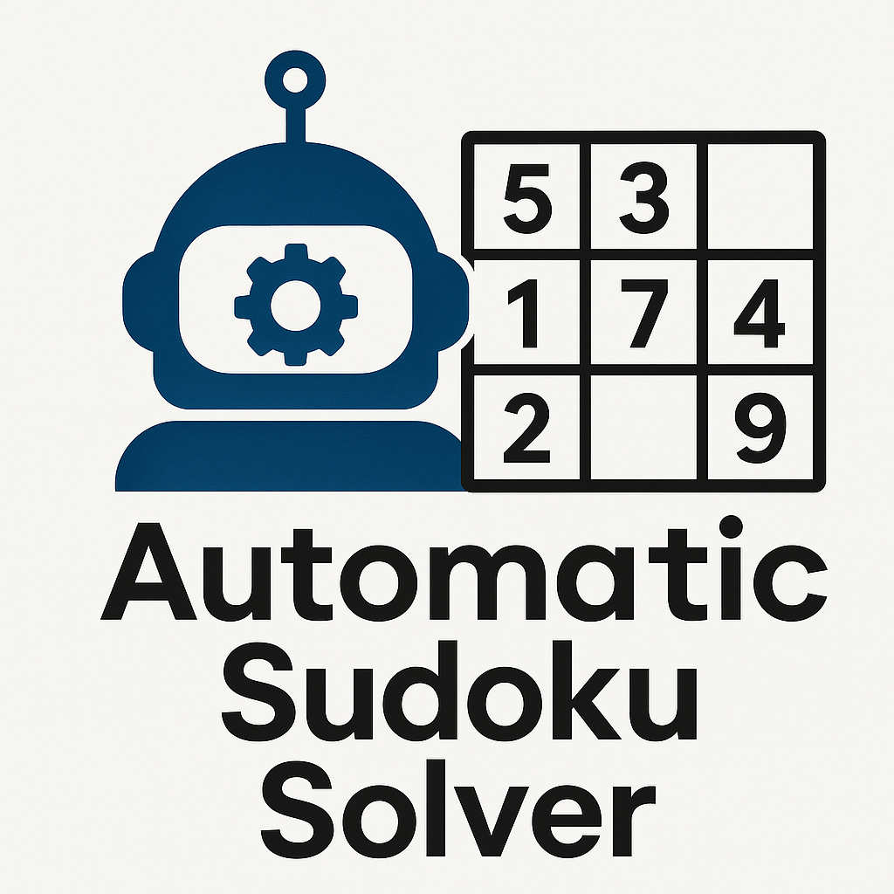

# FT30 Automatic Sudoku Solver 
This project focuses on developing an automated Sudoku solver that integrates image recognition with algorithmic reasoning. The system takes an image of an unsolved Sudoku puzzle, processes it to detect and recognize digits, and applies a backtracking algorithm to generate a valid completed grid.

[Presentation Slides](https://docs.google.com/presentation/d/1hCGh7zgCO9fUspghddKswMbwv7Oy44Nz9_8gRTmTEZE/edit?slide=id.g3a1b57e9357_4_2#slide=id.g3a1b57e9357_4_2)
[Presentation Video]

# Objective
The project aims to create an end-to-end AI system capable of:
  1. Extracting and segmenting Sudoku grids from input images.
  2. Recognizing digits using a trained Convolutional Neural Network (CNN) model.
  3. Solving the puzzle logically through a CSP-based backtracking algorithm.

This pipeline demonstrates how image recognition and search algorithms can work together to solve structured reasoning tasks.

# Getting Started
**Built using:**
- Python

**Packages used:**
- Numpy
- OpenCV
- Tensorflow
- Matplotlib.

**Environment:**
- Python virtual environment

**Algorithm applied:**
- Basic Backtracking
- Minimum Remaining Value
- Foward Checking
- Degree Hueristic
- Least Constraining Value.    

## Clone the Repository
```bash
git clone https://github.com/cyuanjun/CSCI323_Group30.git
cd CSCI323_Group30
```

## Setup Virtual Environment
```bash
python -m venv .venv
# For Windows
venv\Scripts\activate
# For Mac/Linux
source venv/bin/activate
```

## Install Dependencies
```bash
pip install numpy opencv-python tensorflow matplotlib
```

# Running the Sudoku Solver
1. Run main.py:
   ```bash
   python FINAL_SUBMISSION/main.py
   ```
2. Input Sudoku image path:
   ```bash
   Enter path of sudoku image to be solved or (N) to end:
   # enter your image path e.g Images/img1.png
   ```
3. After the outputs for each stage (image preprocessing and Sudoku solving) are displayed, press any key to proceed to the next step.

## Files
### Image Recognition
- FINAL_image_processing.py
- FINAL_digit_recognition.py
  
### Solving
- DegMRVFV_sudoku_solver.py
- IcvDegMrvFc_sudoku_solver.py
- MRV_sudoku_solver.py
- MRVFC_sudoku_solver.py
- sudoku_metrics.py
- sudoku_solver.py
  
### Main
- main.py

### Models
- printed_digits_cnn.keras
  
# Dataset
Dataset and web sources we used for the development of our model.
- [Kaggle: Printed Digits Dataset](https://www.kaggle.com/datasets/kshitijdhama/printed-digits-dataset/versions/56)
- [Testing Images 1](https://www.sudokuweb.org/)
- [Testing Images 2](https://www.websudoku.com/)

# Authors
**Group name:** FT30

**Project number:** 13

**Members:**
- Lee Haeeun
- Chia Yuan Jun
- Lee Jinseo
- Nadon Panwong
